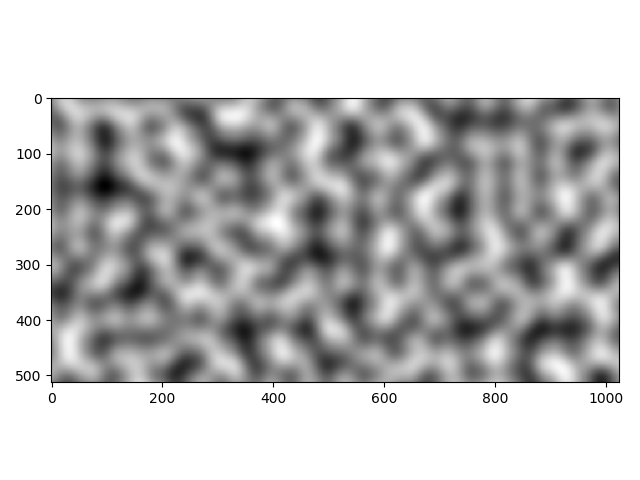
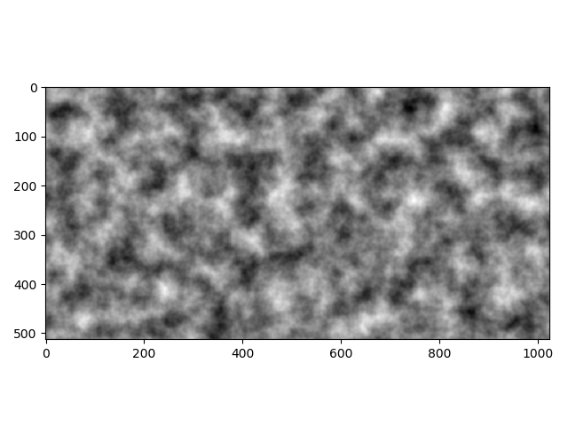

# Perlin Noise

This note is about Perlin noise and accelerating Python codes using C dynamic library. My knowledge of Perlin noise mostly comes from [pvigier](https://github.com/pvigier/perlin-numpy)'s GitHub site, [Adrian](https://flafla2.github.io/2014/08/09/perlinnoise.html)'s blog, [Wikipedia](https://en.wikipedia.org/wiki/Perlin_noise), and this marvelous [post](https://gpfault.net/posts/perlin-noise.txt.html). Anyone who wants to learn Perlin noise is strongly recommended to take a look at those references. There are several ways to accelerate Python codes. I learn one way from this [post](https://zhuanlan.zhihu.com/p/76058539). 

My original idea is to study how to generate a smooth noise, not a white noise. Perlin noise is definitely a good choice. I like to use Python. However, Python does not have the speed to do this in a fast way. If multiples of for loops are unavoided, the performance of Python is horrible! One of the options to accelerate Python is taking the advantage of numpy, if one has the superior numpy skill like Pvigier did in this [post](https://pvigier.github.io/2018/06/13/perlin-noise-numpy.html). Building such skills require fluency about numpy. An alternative way is accerlateing Python by using C dynamic library. 

To build the C dynamic library, use the following in terminal.

```bash
$ mkdir build
$ cd build
$ cmake ..
$ make
$ mv ./lib/libperlinNoise.dylib ../python # Move library to the python folder.
$ cd ../python
$ python cppnoise.py # Use the library as an example in the cppnoise.py code
```

It generates a dynamics library `libperlinNoise.dylib` in the folder `./build/lib`. To illustrate the usage of the dynamics library, just move it to the python folder and execute either `cppnoise.py` or `caltime.py`.

## Speed Comparison

To see the power of C code, let us compare the speed between the numpy and C code. 

```bash
$ python caltime.py
2D noise, numpy time consuming:  0.08261830806732177
3D noise, numpy time consuming:  4.525643992424011
2D noise, cpp time consuming:  0.007184123992919922
3D noise, cpp time consuming:  0.1645211935043335
```

Needlessly to say, C code can do this more than 10 times faster than numpy. Let me aslo remind that there is no single for loop in Pvigier's numpy code. Numpy's vectorized features are fully taken advantaged of. 

## Images





